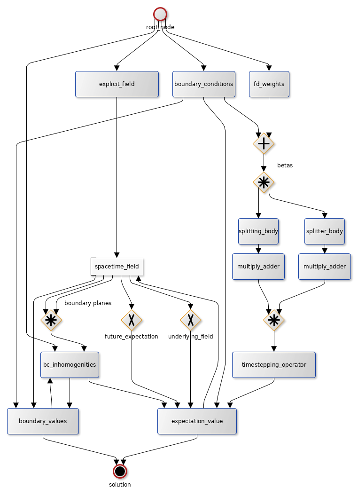

# Fipster [](https://travis-ci.org/johannesgerer/Fipster)
High performance pricing framework for complex financial derivatives using finite difference methods.

Features:

* Versatile configuration via XML (see the [docs](docs))
* Calculate expectation values for **risk neutral valuation**, **utility indifference pricing** and other expectation based pricing methods
* Derive optimal/pessimal strategies for payoffs that depend on decisions (like exercise decisions in Bermuda/American options or **optimal hedging** decisions)
* Provides a novel implementation of the [Cryer algorithm](src/cryer.h) for general linear complementary problems (used for **American type exercise** with more than one exercise region)
* Explicit, Implicit and Crank-Nicholson time-stepping (with [Rannacher steps](src/expectation_value_node_factory.cpp#L48-L101) for **smooth Greeks**)
* **Arbitrary dimensional** state space, i.e. any number of underlyings and driving factors such as stochastic volatility. Curse of dimensionality (somewhat) weakened through automatic Strang splitting.
* Any combination of von-Neumann and Dirichlet **boundary conditions** (boundary conditions are solved using a novel implementation of a [sparse Sherman-Morrison](src/sparse_sherman_morisson.h) approach)
* Arbitrary **nesting and compounding** of derivatives, i.e. calculated prices can be transparantly used as payoffs
* Automatic coarse-grained **parallelization** through the use of an [extended](src/runtime_join_node.h) version of Intel's TBB Flow Graph (see [below](#flow-graph-architecture))
* Automatic **optimal PDE discretization**: the [optimal finite difference stencil](src/finite_difference_weights.cpp#L153) is derived using non-negative least squares

The software was used to derive numerical results for my [dissertation](https://ssrn.com/abstract=2764759).


## Dependencies

* Boost >= 1.54
  * Boost Headers (Ubuntu: libboost-dev)
  * Boost Filesystems (Ubuntu: libboost-filesystem-dev)
  * Boost Program Options (Ubuntu: libboost-program-options-dev)
  * Boost System (Ubuntu: libboost-system-dev)
* Threading Building Blocks (Intel TBB) >= 4.4_20160526
* Eigen Template Library >= 3.2 (Ubuntu: libeigen3-dev)
* gcc >= 6.2.0 | >= 4.8.5 | clang >= 3.5.0
  * compiling with MS Visual C++ should also work


(see also the [travis configuration](.travis.yml))

## Usage

### Compiling / Running

```
make runo
```

which uses the `config.xml` in the same directory.

Alternatively, you can build it with
`make opt`
and the run it with `src/main --config <path>`

#### Developement Build

`make run` or `make debug`

### Configuration

Fipster uses its own XML-based configuration format to describe what to calculate. Please refer to the [docs](docs) and [example configurations](config).

Here is an excerpt of [config/positions.xml](config/positions.xml):

```xml
<boundaryConditions id="BCs1" tolerance="1e-14">
  <stateVariable nr="1">
    <lower  type="Dirichlet" inhomSource="futureValue"/>
    <upper  type="Dirichlet" inhomSource="futureValue"/>
  </stateVariable>
</boundaryConditions>

<finiteDifferenceWeights id="BSIsoWAm">
  <stencilType>OneDiagonal</stencilType>
  <PDE type="BSIso">
    <discountingRate>0.05</discountingRate>
    <volatility>.5</volatility>
    <correlation>0.0</correlation>
    <drift>0.05</drift>
  </PDE>
  <partialDerivativeOrder>2</partialDerivativeOrder>
  <higherOrderWeight>0.9</higherOrderWeight>
</finiteDifferenceWeights>

<expectation id="AmExpectation">
  <boundaryConditions>BCs1</boundaryConditions>
  <finiteDifferenceWeights>BSIsoWAm</finiteDifferenceWeights>
  <strangSymmetrization>true</strangSymmetrization>
  <timeStepping>
    <offset>0</offset>
    <stepSize>0.01e6</stepSize>
  </timeStepping>
  <theta>0.5</theta>
  <rannacherSteps steps="2">
    <strangSymmetrization>false</strangSymmetrization>
    <stepSize>0.005e6</stepSize>
    <theta>1</theta>
  </rannacherSteps>
</expectation>

<option id="AmOption">
  <discountingRate>0.0</discountingRate>
	<expectation>AmExpectation</expectation>
	<times>
		<stop>1e8</stop>
		<offset>1e8</offset>
		<stepSize>0.01e6</stepSize>
	</times>
	<exercise>
		<implicit>false</implicit>
		<value>payoff1</value>
	</exercise>
</option>

<solution active="1" id="Decisions0" hedgingPos="true">
  <fields>
		<option id="AmOption" exercise="always"/>
		<option id="Option" exercise="always" skip="2">
			<deltaHedging>
				<option id="AmOption" exercise="always"/>
			</deltaHedging>
		</option>
  </fields>
  <times>
    <start>.75e8</start>
    <offset>.75e8</offset>
    <stop>1e8</stop>
    <stepSize>.12e7</stepSize>
  </times>
  <fixedPlotTime>1e8</fixedPlotTime>
  <grid>grid1</grid>
  <singleValues>
    <at><x>40</x></at>
    <at><x>45</x></at>
    <at><x>120</x></at>
  </singleValues>
</solution>
```

The corresponding program output on a quadcore CPU, 
where `.x....` is used to indicate which CPU core calculated a certain step:

```shell
> src/main --config config/positions.xml 
careful: discounting_rate only applies to the expectation, thus it is not suitable to calcuate higher moments of discounted quantites by solving this pde with undiscounted final values
x.....: Parser  | create_graph_and_run (parallel)
x.....: Hedging grid (hedging_grid_f):

[("cache hit", 9616979), ("cache miss", 545119), ("continue_nodes", 7), ("edges", 1384335), ("function_nodes", 518), ("joined_function_node", 358862), ("runtime_join_nodes", 420172)]
Cache size of 'boundary_conditions':1
Cache size of 'fdweights':2
Cache size of 'payoff1':2502
Cache size of 'Option':56700
Cache size of 'AmOption':5002
Cache size of 'Expectation1':169200
Cache size of 'AmExpectation':10002
Cache size of 'splitter':2
Cache size of 'timestepping_operator':4
x.....: GRAPH  | Start and wait for all
.x....: EXPL FL (0) | START
.x....: EXPL FL| DONE
x.....: EXPL FL (0) | START
x.....: EXPL FL| DONE
..x...: WEIGHTS| for 2 neighbors and 2 of PDE terms
..x...: WEIGHTS| (unconstrained weights) are NOT overdetermined
..x...: WEIGHTS| nSites: 298
..x...: WEIGHTS| Accessing Least Squares TLS
..x...: WEIGHTS| DONE, maxNorm:0.000e+00 in 6.280e-05s
..x...: &gsi: 0x7fabc0002950
..x...: WEIGHTS| DONE systems information in 7.717e-06s
..x...: BCs    | START
..x...: BCs    | DONE, assembled and inverted: 8.352e-06s
..x...: SPLITIN| START
..x...: SPLITIN| TESTING Split
..x...: SPLITIN| DONE TESTING Split
..x...: SPLITIN| DONE
..x...: WEIGHTS| for 2 neighbors and 2 of PDE terms
..x...: WEIGHTS| (unconstrained weights) are NOT overdetermined
..x...: WEIGHTS| nSites: 298
..x...: WEIGHTS| DONE, maxNorm:0.000e+00 in 5.090e-05s
..x...: &gsi: 0x7fabc0004b20
..x...: WEIGHTS| DONE systems information in 4.658e-06s
..x...: SPLITIN| START
..x...: SPLITIN| TESTING Split
..x...: SPLITIN| DONE TESTING Split
..x...: SPLITIN| DONE
..x...: EXPECT | Accessing Time Stepping TLS
.x....: EXPECT | Accessing Time Stepping TLS
...x..: EXPECT | Accessing Time Stepping TLS
x.....: EXPECT | Accessing Time Stepping TLS
.x....: OUTPUT (Decisions0 at time 100000000 on grid grid1) | START
...x..: OUTPUT (Decisions2 at time 100000000 on grid grid1) | START
[...]
x.....: OUTPUT (Decisions0 at time 76200000 on grid grid1) | START
..x...: OUTPUT (Decisions1 at time 76200000 on grid grid1) | START
.x....: OUTPUT (Decisions2 at time 76200000 on grid grid1) | START
..x...: OUTPUT (Decisions1 at time 75000000 on grid grid1) | START
x.....: OUTPUT (Decisions0 at time 75000000 on grid grid1) | START
...x..: OUTPUT (Decisions2 at time 75000000 on grid grid1) | START
```


## Flow graph architecture


